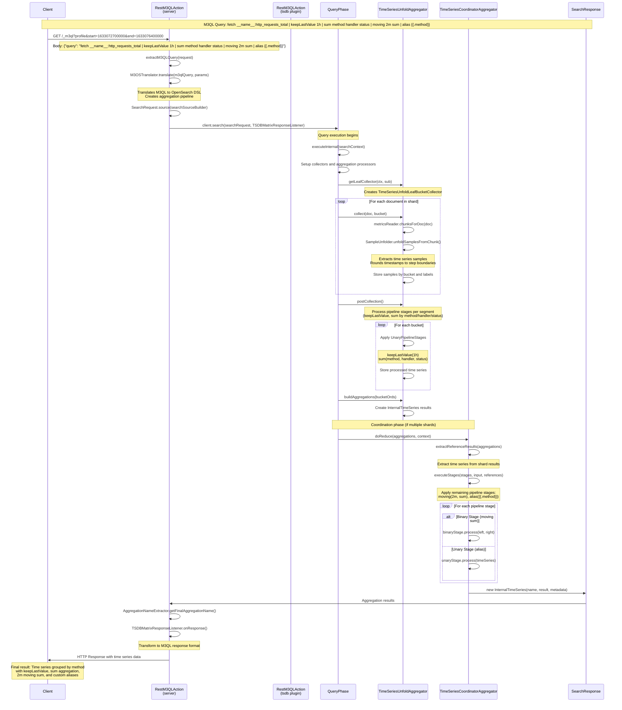

# OpenSearch-TSDB

### Running the tests

```
./gradlew check
```

### Running testClusters with the plugin installed
```
./gradlew run
```

Then you can see that your plugin has been installed by running:
```
curl -XGET 'localhost:9200/_cat/plugins'
```

## Create a TSDB engine index
(optional) You can also run with multiple nodes, if you want to enable replicas.
```bash
./gradlew run -PnumNodes=2
```
Create index with replicas:
```bash
curl -X PUT -H 'Content-Type: application/json' http://localhost:9200/my-index --data '{
  "settings": {
    "index.tsdb_engine.enabled":true,
    "index.tsdb_engine.labels.storage_type": "binary",
    "index.tsdb_engine.lang.m3.default_step_size": "10s",
    "index.number_of_shards": 1,
    "index.number_of_replicas": 1,
    "index.store.factory": "tsdb_store",
    "index.translog.durability": "async",
    "index.translog.sync_interval": "1s",
    "refresh_interval": "1s"
  },
  "mappings": {
   "properties": {
     "series_ref": {
       "type": "long",
       "doc_values": false
     },
     "labels": {
         "type": "keyword"
     },
     "value": {
         "type": "float",
         "doc_values": false
     },
     "timestamp": {
         "type": "date",
         "format": "epoch_millis",
         "doc_values": false
     },
     "timestamp_range": {
         "type": "long_range"
     }
   }
 }
}'
```

Add debug log level to cluster settings
```bash
curl -X PUT -H 'Content-Type: application/json' http://localhost:9200/_cluster/settings --data '{
  "transient": {
    "logger.org.opensearch.tsdb.query.rest": "DEBUG"
  }
}'
```

Configure remote index settings cache (for cross-cluster search)
```bash
# Cache TTL - Default: 2h, Minimum: 1h, Dynamic setting
# Cache Size - 1000
curl -X PUT -H 'Content-Type: application/json' http://localhost:9200/_cluster/settings --data '{
  "persistent": {
    "tsdb_engine.remote_index_settings.cache.ttl": "2h",
    "tsdb_engine.remote_index_settings.cache.max_size": 1000
  }
}'
```


## Index some metrics
### bulk request using flat-json format
Expected json schema
```json5
{
  "labels": "__name__ http_requests_total method POST handler /api/items status 200", // space separated k/v pairs
  "timestamp": 1633072800000,  // millisecond unix timestamp
  "value": 1.1  // float
}
```
```bash
curl -X POST -H 'Content-Type: application/json' http://localhost:9200/my-index/_bulk --data-binary '
{ "index": { "_index": "my-index" } }
{ "labels": "__name__ http_requests_total method POST handler /api/items status 200", "timestamp": 1633072800000, "value": 1.1 }
{ "index": { "_index": "my-index" } }
{ "labels": "__name__ http_requests_total method POST handler /api/stores status 200", "timestamp": 1633072800000, "value": 2.1 }
{ "index": { "_index": "my-index" } }
{ "labels": "__name__ http_requests_total method POST handler /api/items status 200", "timestamp": 1633076400000, "value": 1.2 }
{ "index": { "_index": "my-index" } }
{ "labels": "__name__ http_requests_total method POST handler /api/stores status 200", "timestamp": 1633076400000, "value": 2.2 }
{ "index": { "_index": "my-index" } }
{ "labels": "__name__ http_requests_total method POST handler /api/items status 200", "timestamp": 1633076500000, "value": 1.3 }
{ "index": { "_index": "my-index" } }
{ "labels": "__name__ http_requests_total method POST handler /api/items status 200", "timestamp": 1633076600000, "value": 1.4 }
{ "index": { "_index": "my-index" } }
{ "labels": "__name__ http_requests_total method POST handler /api/items status 200", "timestamp": 1633076700000, "value": 1.5 }
'
```

### single request using prometheus remote write v1 json format
```bash
curl -X POST -H 'Content-Type: application/json' http://localhost:9200/my-index/_doc --data '{
  "labels":"__name__ http_requests_total method POST handler /api/items status 200",
  "value":1.1,
  "timestamp":1633072800000
}'

curl -X POST -H 'Content-Type: application/json' http://localhost:9200/my-index/_doc --data '{
  "labels":"__name__ http_requests_total method POST handler /api/items status 200",
  "value":1.2,
  "timestamp":1633076400000
}'

curl -X POST -H 'Content-Type: application/json' http://localhost:9200/my-index/_doc --data '{
  "labels":"__name__ http_requests_total method POST handler /api/items status 200",
  "value":1.3,
  "timestamp":1633076500000
}'

curl -X POST -H 'Content-Type: application/json' http://localhost:9200/my-index/_doc --data '{
  "labels":"__name__ http_requests_total method POST handler /api/items status 200",
  "value":1.4,
  "timestamp":1633076600000
}'

curl -X POST -H 'Content-Type: application/json' http://localhost:9200/my-index/_doc --data '{
  "labels":"__name__ http_requests_total method POST handler /api/items status 200",
  "value":1.5,
  "timestamp":1633076700000
}'
```
Note that if you want to index both series like this, you will need to make the API calls sorted by timestamp (instead
of by series), because the engine expects that samples will not arrive significantly out of order (even across series).
```bash
curl -X POST -H 'Content-Type: application/json' http://localhost:9200/my-index/_doc --data '{
  "labels":"__name__ http_requests_total method POST handler /api/stores status 200",
  "value":2.1,
  "timestamp":1633072800000
}'

curl -X POST -H 'Content-Type: application/json' http://localhost:9200/my-index/_doc --data '{
  "labels":"__name__ http_requests_total method POST handler /api/stores status 200",
  "value":2.2,
  "timestamp":1633076400000
}'
```

Now samples of existing series should be immediately queriable.
New series requires an internal reader refresh to be visible in queries (every second).
You can also manually trigger a refresh to trigger segment flush and reader refresh so that the indexed documents are searchable.
_flush will also flush any "closed" in-memory time series chunks into a "block" index.
```bash
curl -XGET http://localhost:9200/my-index/_flush
curl -XGET http://localhost:9200/my-index/_refresh
```

## Query the raw metrics using OpenSearch DSL
Note: this only works if index.tsdb_engine.labels.storage_type is configured as `sorted_set` (does not work if it's `binary` type).
For binary type, you should use the language APIs like M3QL or PPL to query the data, which has custom decoding logic for binary label storage.

Query all
```bash
curl -X POST -H 'Content-Type: application/json' 'http://localhost:9200/my-index/_search?request_cache=false' --data '{
  "docvalue_fields": ["labels"],
  "size": 10,
  "query": {
    "match_all": {}
  },
  "aggs": {}
}' | jq
```

Query by label
```bash
curl -X POST -H 'Content-Type: application/json' 'http://localhost:9200/my-index/_search?request_cache=false' --data '{
  "docvalue_fields": ["labels"],
  "query": {
    "bool": {
      "filter": [
        {
          "term": {
            "labels": "handler:/api/items"
          }
        }
      ]
    }
  }
}' | jq
```

### Fetch labels via _search API
Use the `ext` section with `tsdb_labels` to fetch decoded labels from DocValues:
```bash
curl -X GET "localhost:9200/my-index/_search?pretty" -H 'Content-Type: application/json' -d '{
  "ext": { "tsdb_labels": {} },
  "query": { "term": { "labels": "method:POST" } },
  "size": 10,
  "_source": false
}'
```
Response:
```json
{
  "hits": {
    "hits": [
      {
        "_index": "my-index",
        "_score": 1.0,
        "fields": {
          "tsdb_labels": [
            {
              "__name__": "http_requests_total",
              "handler": "/api/items",
              "method": "POST",
              "status": "200"
            }
          ]
        }
      }
    ]
  }
}
```

## Aggregations

### AsPercentQuery with unfold_pipeline and coordinator_pipeline

```bash
curl -X POST -H 'Content-Type: application/json' 'http://localhost:9200/my-index/_search?request_cache=false' --data '
{
  "size": 0,
  "query": {
    "bool": {
      "filter": [
        {
          "term": {
            "labels": {
              "value": "__name__:http_requests_total",
              "boost": 1.0
            }
          }
        },
        {
          "range": {
            "min_timestamp": {
              "from": null,
              "to": 1633076400000,
              "include_lower": true,
              "include_upper": true,
              "boost": 1.0
            }
          }
        },
        {
          "range": {
            "max_timestamp": {
              "from": 1633072580000,
              "to": null,
              "include_lower": true,
              "include_upper": true,
              "boost": 1.0
            }
          }
        }
      ],
      "adjust_pure_negative": true,
      "boost": 1.0
    }
  },
  "profile": true,
  "aggregations": {
    "0_unfold": {
      "time_series_unfold": {
        "min_timestamp": 1633072580000,
        "max_timestamp": 1633076400000,
        "step": 10000,
        "stages": [
          {
            "type": "sum",
            "group_by_labels": [
              "method",
              "handler",
              "status"
            ]
          }
        ]
      }
    },
    "0_coordinator": {
      "coordinator_pipeline": {
        "buckets_path": [],
        "stages": [
          {
            "type": "moving",
            "point_interval": 12,
            "function": "sum"
          },
          {
            "type": "min",
            "group_by_labels": [
              "handler",
              "method"
            ]
          },
          {
            "type": "avg",
            "group_by_labels": [
              "method"
            ]
          },
          {
            "type": "max",
            "group_by_labels": [
              "method"
            ]
          },
          {
            "type": "removeEmpty",
            "d": false
          },
          {
            "type": "alias",
            "alias_pattern": "{{.method}}"
          }
        ],
        "references": {
          "0_unfold": "0_unfold"
        },
        "inputReference": "0_unfold"
      }
    }
  }
}
' | jq
```

Response
```json
{
  "took": 4,
  "timed_out": false,
  "_shards": {
    "total": 1,
    "successful": 1,
    "skipped": 0,
    "failed": 0
  },
  "hits": {
    "total": {
      "value": 4,
      "relation": "eq"
    },
    "max_score": null,
    "hits": []
  },
  "aggregations": {
    "0_unfold": {
      "meta": {},
      "timeSeries": [
        {
          "hash": -268986388,
          "minTimestamp": 1633069100000,
          "maxTimestamp": 1633076400000,
          "step": 10000,
          "samples": [
            {
              "timestamp": 1633072800000,
              "value": 3.1999999284744263
            },
            {
              "timestamp": 1633076400000,
              "value": 3.4000000953674316
            }
          ],
          "labels": {
            "method": "POST"
          }
        }
      ]
    },
    "0_coordinator": {
      "timeSeries": [
        {
          "hash": -268986388,
          "alias": "rps POST",
          "minTimestamp": 1633069100000,
          "maxTimestamp": 1633076400000,
          "step": 10000,
          "samples": [
            {
              "timestamp": 1633072800000,
              "value": 3.1999999284744263
            },
            {
              "timestamp": 1633076400000,
              "value": 6.600000023841858
            }
          ],
          "labels": {
            "method": "POST"
          }
        }
      ]
    }
  }
}
```

## M3QL Endpoint

### explain
```bash
curl -X GET "localhost:9200/_m3ql?explain&start=1633072700000&end=1633076400000" -H 'Content-Type: application/json' -d'{"query": "fetch __name__:http_requests_total | sum method | moving 1h sum | alias rps {{.method}}"}'
```
### date math
```bash
curl -X GET "localhost:9200/_m3ql?explain&start=now/m-1h&end=now/m" -H 'Content-Type: application/json' -d'{"query": "fetch __name__:http_requests_total | sum method | alias rps {{.method}}"}'
```
### alias
```bash
curl -X GET "localhost:9200/_m3ql?explain=false&start=1633072700000&end=1633076400000" -H 'Content-Type: application/json' -d'{"query": "fetch __name__:http_requests_total | sum method handler status |  moving 2m sum | minimum handler method | averageSeries method | maxSeries | removeEmpty | alias max "}' | jq
```
```bash
curl -X GET "localhost:9200/_m3ql?start=1633072700000&end=1633076400000" -H 'Content-Type: application/json' -d'{"query": "fetch __name__:http_requests_total  | alias rps {{.method}}"}' | jq
```
```bash
curl -X GET "localhost:9200/_m3ql?start=1633072700000&end=1633076400000" -H 'Content-Type: application/json' -d'{"query": "fetch __name__:http_requests_total  | alias \"rps {{.method}}\""}' | jq
```
```bash
curl -X GET "localhost:9200/_m3ql?explain=false&start=1633072700000&end=1633076400000" -H 'Content-Type: application/json' -d'{"query": "fetch __name__:http_requests_total | sum handler method | moving 1h sum | aliasByTags handler method"}'| jq
```

### With federation routing partition metadata
Note: the RestM3QlAction handler may be routing requests based on `partitions` query param, but making `pushdown=true|false` decision based on the presence of `resolved_partitions` in the request body. Check the code for latest behavior.
```bash
curl -X GET "localhost:9200/_m3ql?explain=false&start=1633072700000&end=1633076400000&partitions=my-index" -H 'Content-Type: application/json' -d '{
    "query": "fetch __name__:http_requests_total | sum handler method | moving 1h sum | aliasByTags handler method",
    "resolved_partitions": {
      "partitions": [
        {
          "fetch_statement": "__name__:http_requests_total",
          "partition_windows": [
            {
              "partition_id": "cluster1:index-a",
              "start": "2025-12-13T00:44:49Z",
              "end": "2025-12-13T02:14:49Z",
              "routing_keys": [
                { "key": "service", "value": "api" },
                { "key": "region", "value": "us-west" }
              ]
            },
            {
              "partition_id": "cluster2:index-b",
              "start": "2025-12-13T00:44:49Z",
              "end": "2025-12-13T02:14:49Z",
              "routing_keys": [
                { "key": "service", "value": "api" },
                { "key": "region", "value": "us-west" }
              ]
            }
          ]
        }
      ]
    }
  }' | jq
```

Execute with profile:true to get debug info from the TimeSeriesUnfoldAggregator
```bash
curl -X POST -H 'Content-Type: application/json' 'http://localhost:9200/my-index/_search?request_cache=false' --data '{
  "profile": true,
  "size": 0,
  "query": {
    "bool": {
      "filter": [
        {
          "term": {
            "labels": {
              "value": "__name__:http_requests_total",
              "boost": 1.0
            }
          }
        }
      ],
      "adjust_pure_negative": true,
      "boost": 1.0
    }
  },
  "aggregations": {
    "0_unfold": {
      "time_series_unfold": {
        "min_timestamp": 1633069100000,
        "max_timestamp": 1633080000000,
        "step": 10000,
        "stages": [
          {
            "type": "sum",
            "group_by_labels": [
              "method"
            ]
          }
        ]
      }
    },
    "0_coordinator": {
      "coordinator_pipeline": {
        "buckets_path": [],
        "stages": [
          {
            "type": "moving",
            "point_interval": 600,
            "function": "sum"
          },
          {
            "type": "alias",
            "alias_pattern": "rps {{.method}}"
          }
        ],
        "references": {
          "0_unfold": "0_unfold"
        },
        "inputReference": "0_unfold"
      }
    }
  }
}'
```

## Inspect index data on disk
```bash
tree build/testclusters/integTest-0/data
```
```plaintext
build/testclusters/integTest-0/data
└── nodes
    └── 0
        ├── indices
        │	 └── ugk-7YQoR6O_cJGxGvg_1g
        │	     ├── 0
        │	     │	 ├── index
        │	     │	 │	 ├── segments_3
        │	     │	 │	 ├── segments_4
        │	     │	 │	 ├── segments_5
        │	     │	 │	 └── write.lock
        │	     │	 ├── metrics
        │	     │	 │	 ├── blocks
        │	     │	 │	 │	 └── block_1633075200000
        │	     │	 │	 │	     ├── _0.cfe
        │	     │	 │	 │	     ├── _0.cfs
        │	     │	 │	 │	     ├── _0.si
        │	     │	 │	 │	     ├── segments_1
        │	     │	 │	 │	     └── write.lock
        │	     │	 │	 └── head
        │	     │	 │	     └── live_series_index
        │	     │	 │	         ├── _0.cfe
        │	     │	 │	         ├── _0.cfs
        │	     │	 │	         ├── _0.si
        │	     │	 │	         ├── _1.cfe
        │	     │	 │	         ├── _1.cfs
        │	     │	 │	         ├── _1.si
        │	     │	 │	         ├── segments_2
        │	     │	 │	         └── write.lock
        │	     │	 ├── _state
        │	     │	 │	 ├── retention-leases-5.st
        │	     │	 │	 └── state-0.st
        │	     │	 └── translog
        │	     │	     ├── translog-2.tlog
        │	     │	     └── translog.ckp
        │	     └── _state
        │	         └── state-1.st
        ├── node.lock
        └── _state
            ├── _f.cfe
            ├── _f.cfs
            ├── _f.si
            ├── _i.cfe
            ├── _i.cfs
            ├── _i.si
            ├── manifest-0.st
            ├── node-0.st
            ├── segments_q
            └── write.lock

16 directories, 33 files

```

## Cleanup: Delete the index
```bash
curl -X DELETE http://localhost:9200/my-index
```

# High Level Call Flow



## License
This code is licensed under the Apache 2.0 License. See [LICENSE.txt](LICENSE.txt).

## Copyright
Copyright OpenSearch Contributors. See [NOTICE](NOTICE.txt) for details.
